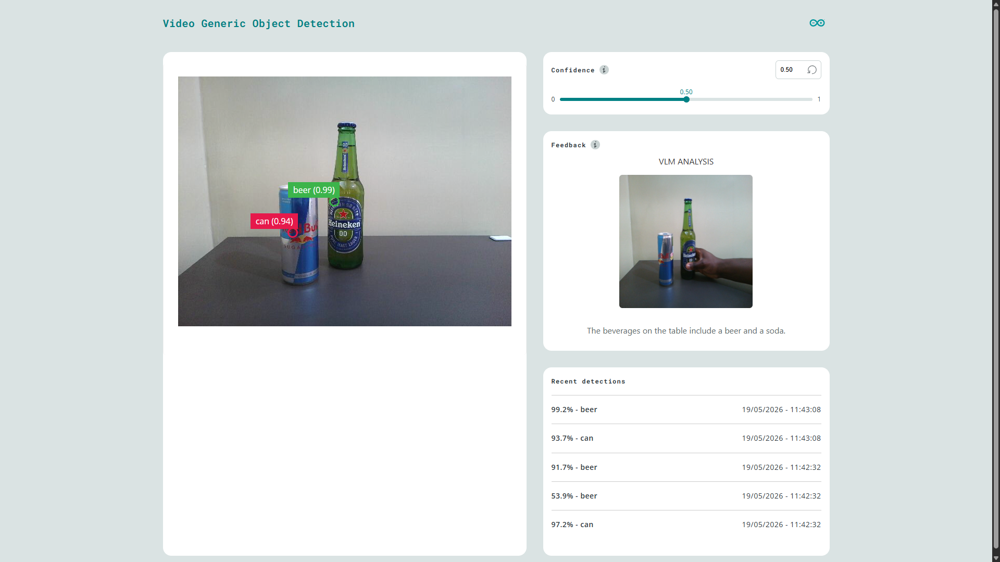
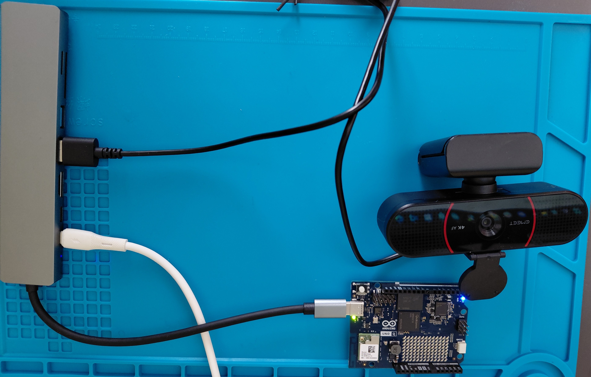
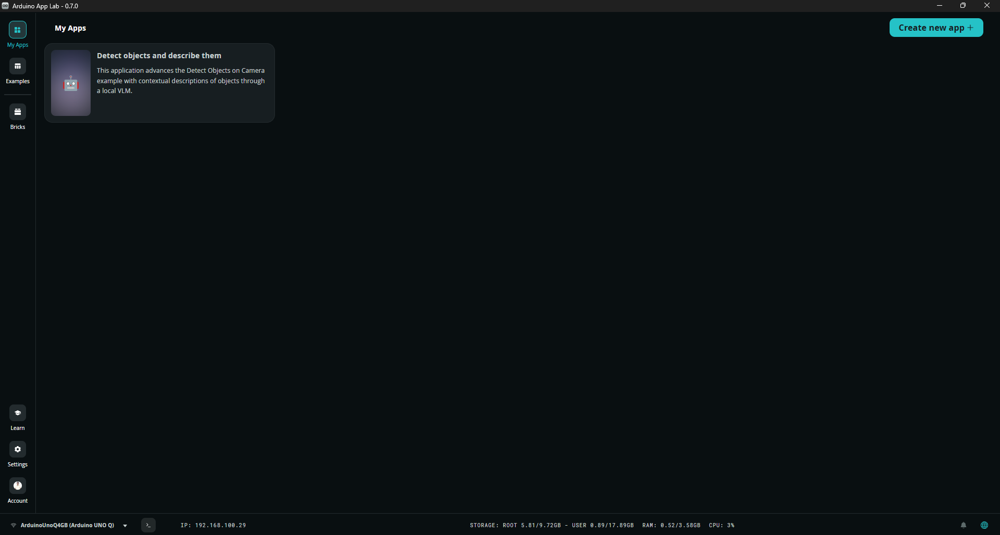

# Detect objects and describe them

The **[Detect Objects on Camera](https://github.com/arduino/app-bricks-examples/tree/main/examples/video-generic-object-detection)** example runs an optimized, lightweight AI model that achieves an exceptionally low latency when run on the UNO Q. When the example is run on the 4GB board, the CPU utilization is around 43% while the RAM consumption is around 740MB out of the available 3.58GB. This leaves approximately 2.84GB of free memory. 

This application leverages on this headroom to trigger a local Vision Language Model (VLM) when a specific object is detected (cascading in AI systems). Although GenAI models are resource demanding, advancements in the field have resulted in models such as the SmolVLM-256M and SmolVLM-500M which are both capable of running on the 2GB and 4GB UNO Q boards (tested and confirmed). The UNO Q however peeks at 99% CPU utilization when running the VLM models and it is important to monitor the CPU temperatures to prevent overheating.


  
## Hardware and Software Requirements

### Hardware

- [Arduino® UNO Q](https://store.arduino.cc/products/uno-q): either the 2GB or 4GB variant.
- USB camera
- USB-C® hub adapter with external power
- A power supply (5 V, 3 A) for the USB hub
- Personal computer with internet access

### Software

- Arduino App Lab
- Edge Impulse Studio

## How to Use the Application

First connect a USB-C Hub to the UNO Q. Next, connect a USB webcam to the Hub and power the system through the Power Delivery slot.



Note that you need to select a model for the video_objectdetection brick. You can [load custom models](https://www.youtube.com/watch?v=X-GBxtfEP-8) to the boar using platforms such as Edge Impulse. This model will be run by main.py and trigger the VLM once specified object(s) are detected.

1. On your personal computer, clone the GitHub repository:
```
git clone https://github.com/SolomonGithu/object-detection-and-vlm-description.git
```

This repo includes backend and frontend code to capture frames from a USB camera and passes them to a TinyML model. The camera feed and inference results are shown on the UI, similar to how the base project (Detect Objects on Camera) implements it.

2. Next, use this [link](https://drive.google.com/drive/folders/1uC8fEhzNWdk8rSUXl712yHN8fm2-rlu8?usp=sharing) to download the runtime libraries and model files used by llama.cpp to run the SmolVLM-500M model locally from main.py. Once the download is completed, copy all the files in the Google Drive folder to the [`models`](models/) folder of this repo.

In [main.py](python/main.py), `vlm_prompting_label` defines the class which when detected will trigger the VLM to be loaded and prompted with a text defined by `vlm_prompt`. To reduce computational data, a frame is first resized before passing it to the SmolVLM-256M model. In a Vision-Language Model (VLM), a prompt consists of text inputs and visual inputs (such as images or video frames). These are then converted into tokens which are numerical chunks of data that the AI processes.

3. Afterwards, On your personal computer, use SCP, VS Code's remote SSH extension or software such as WinSCP to copy the repo to the `/home/arduino/ArduinoApps/` folder on your UNO Q. Once this is completed, open App Lab and you should see the application listed in the 'My Apps' section.



4. On App Lab, click the application and launch it with the 'Run' button. Starting the application for the first time will take some seconds since the system needs to pull necessary Docker images. Once this is finished the application container will be started and the app will automatically open in the web browser. You can also open the Web UI manually on the browser by setting URL to the local IP address of the UNO Q and port 7000.

> **Note:** You can use either the SmolVLM-256M or SmolVLM-500M model. However, in my experiments involving image description of beverages on a table, the SmolVLM-256M model showed significant limitations in captioning. It occasionally produced hallucinated text, misidentified objects, and was less reliable in following instructions compared to the expectations. Looking at the model’s [training details](https://huggingface.co/HuggingFaceTB/SmolVLM-256M-Instruct#training-data), we can see that just 18% of the training data was dedicated to image captioning tasks. This and the smaller parameter size are likely constrains of its capacity, making it suitable for relatively simple image description use cases rather than detailed visual reasoning.

To load the SmolVLM-256M model, you need to first download these open-source files and put them in the [`models`](models/) folder: mmproj-SmolVLM-256M-Instruct-Q8_0.gguf and SmolVLM-256M-Instruct-Q8_0.gguf. Next, in [main.py](python/main.py) update `model_path` and `mmproj_path` to point to the downloaded SmolVLM-256M files.